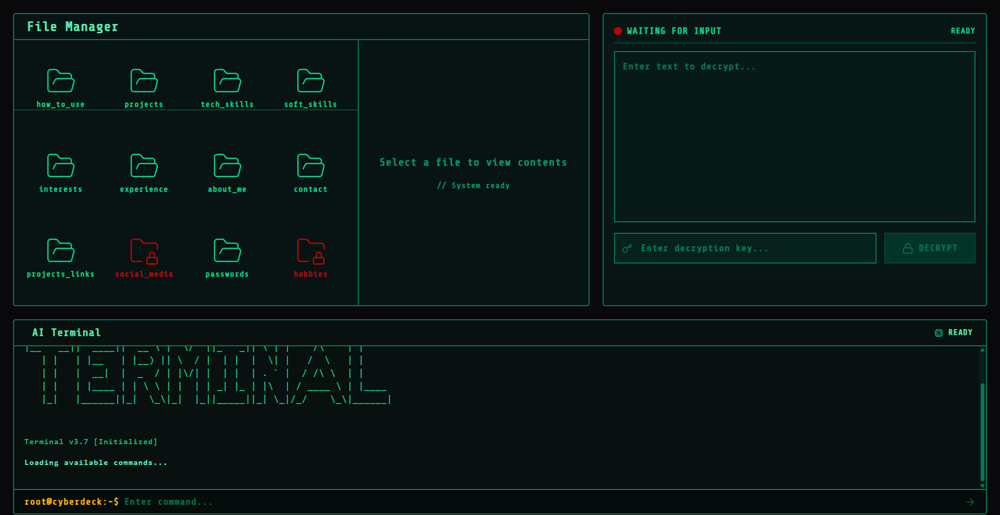

# CyberPortfolio

An interactive cyberpunk-themed portfolio showcasing software engineering skills and projects with a custom cryptographic system.


<div align="center">
  
  
  
  
</div>

## 🎯 Purpose

CyberPortfolio demonstrates a portfolio with advanced security features and an immersive cyberpunk aesthetic. The system features custom encryption algorithms for file protection and a dynamic terminal interface for enhanced interaction.

## 🚀 Tech Stack

- **Frontend Framework**: Next.js 15.3.1
- **UI Library**: React 19.0.0
- **Styling**: Tailwind CSS 4
- **Animations**: Framer Motion 12.9.2
- **Icons**: Lucide React 0.503.0
- **Font**: Share Tech Mono (Cyberpunk aesthetic)

## ✨ Features

### 1. File Management System

- **Secure File System**: Protected files with access control
- **Authentication**: Password-protected file access
- **Visual Feedback**: Folder lock states and unlocking animations

### 2. Cryptographic Engine

- **Custom Cipher**: AES-based Feistel network implementation
- **Key System**: 256-byte key structure (4x64-byte keys)
- **Decryption Features**: Real-time decryption with visual feedback
- **Security**: CBC mode operation with PKCS#7 padding

### 3. Terminal Interface

- **Command System**: Dynamic terminal for navigation
- **Interactive Experience**: Real-time command processing
- **Status Indicators**: Visual feedback for system state

### 4. Immersive UI/UX

- **Matrix Animation**: Custom entrance animation
- **Cyberpunk Aesthetic**: Emerald-themed design with glitch effects
- **Responsive Design**: Mobile and desktop optimized

## 🔐 Cryptographic Algorithm

The portfolio implements a custom encryption system based on:

- AES S-box operations
- Feistel network structure
- 16-round encryption/decryption
- CBC mode with unique IV per file

## 🛠️ Setup & Installation

### Prerequisites

- Node.js 16.x or higher
- npm/yarn/pnpm

### Installation Steps

1. **Clone the repository**

   ```bash
   git clone https://github.com/RazvanBordinc/cyber-portfolio.git
   cd cyber-portfolio
   ```

2. **Install dependencies**

   ```bash
   npm install
   # or
   yarn install
   ```

3. **Configure environment**
   Create `.env.local` file:

   ```env
   NEXT_PUBLIC_API_URL=your_api_url
   ```

4. **Run development server**

   ```bash
   npm run dev
   # or
   yarn dev
   ```

5. **Build for production**
   ```bash
   npm run build
   npm start
   ```

## 📁 Project Structure

```
cyberportfolio/
├── src/
│   ├── app/              # Next.js app router pages
│   ├── components/       # React components
│   │   ├── animations/   # Animation components
│   │   ├── screen/       # Main interface components
│   │   └── shared/       # Reusable components
│   ├── lib/             # Libraries and utilities
│   │   ├── data/        # Data fetching
│   │   └── utils/       # Utility functions
│   └── styles/          # CSS and styling
├── public/              # Static assets
└── config files         # Next.js, ESLint, etc.
```

## 🔧 Usage

### File Manager

1. Browse protected files with visual lock indicators
2. Enter password to decrypt specific files
3. View unlocked file contents

### Decryption Terminal

1. Paste encrypted content
2. Enter decryption key
3. Watch real-time decryption animation
4. View decrypted content

### Terminal

1. Type `help` to see available commands
2. Use folder names to access content
3. Dynamic responses with command suggestions

## 🎨 Customization

### Theme Colors

Modify `globals.css` for theme customization:

```css
:root {
  --emerald-700: #047857;
  --emerald-500: #10b981;
  /* Custom color variables */
}
```

### Animations

Configure animation timing in `EntranceAnimation.js`:

```javascript
const thinkTime = 800 + Math.random() * 1500;
```

## 📱 Responsive Design

The portfolio is fully responsive with:

- Mobile-first approach
- Adaptive grid layouts
- Touch-friendly interfaces
- Responsive typography

## 🔒 Security Considerations

- No sensitive data stored in localStorage
- Secure key handling
- Input validation for all user inputs
- No external script loading except from CDN

## 🚀 Deployment

### Vercel (Recommended)

1. Push to GitHub repository
2. Connect to Vercel
3. Deploy automatically

### Manual Deployment

1. Build the project
2. Export static files
3. Deploy to your hosting provider

## 📄 License

This project is licensed under the MIT License - see the LICENSE file for details.

## 🤝 Contributing

Contributions are welcome! Please read our contributing guidelines before submitting pull requests.

## 📧 Contact

Feel free to reach out for collaboration or questions about the cryptographic implementation.

---

Made with ❤️ by Razvan
